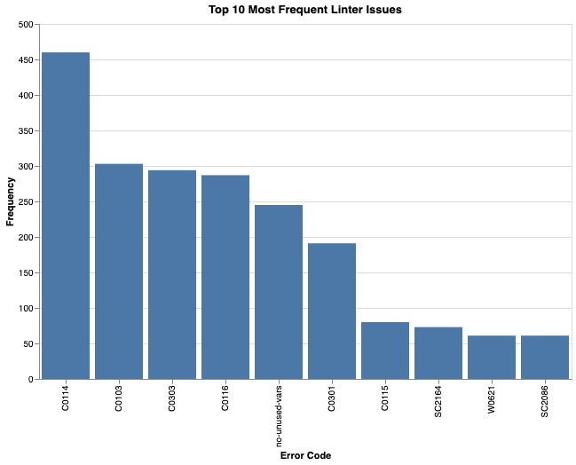

# Data-542-Group-4
# ChatGPT Analysis: Developer Interactions and Code Quality

## Group Members
- Shiqi Zhang
- Tyler Stevenson
- Zefeng Pei

## Overview
This project investigates how developers interact with ChatGPT for software development and the quality of ChatGPT-generated code. The analysis addresses three key research questions:

1. **What types of issues do developers most commonly present to ChatGPT?**
2. **Can we identify patterns in the prompts developers use and correlate these patterns with successful issue resolution?**
3. **What types of quality issues are common in ChatGPT-generated code, focusing on Python, JavaScript, and Bash?**

## Dataset
The dataset used for this project was obtained from the [DevGPT](https://github.com/NAIST-SE/DevGPT) repository. It includes snapshots of ChatGPT interactions with developers, which were analyzed to address the research questions.

## Methodology
### Research Question 1: Types of Issues
- **Data Sources:** ChatGPT conversation datasets (`snapshot_20231012` and `snapshot_20230803`) from the DevGPT repository.
- **Classification:** Prompts categorized into five types using MiniLM embeddings and XGBoost.
- **Key Findings:**
  - Most common categories: General Inquiry (546) and Theoretical Questions (493).
  - Least common: Code Help (169).

### Research Question 2: Patterns in Prompts
- **Data Sources:** `Discussion Sharing` and `Issue Sharing` datasets from DevGPT.
- **Methods:**
  - Applied Latent Dirichlet Allocation (LDA) for topic modeling.
  - Used TF-IDF to identify key terms across three groups (Total, Closed Issues, Open Issues).
- **Key Findings:** Prompts were predominantly technical, with minimal differences between resolved and unresolved issues.

### Research Question 6: Code Quality
- **Scope:** Focused on Python, JavaScript, and Bash.
- **Methods:**
  - Analyzed 500 code snippets per language using linters (`pylint`, `eslint`, and `shellcheck`).
  - Filtered out non-meaningful/context-dependent errors (e.g., undefined variables, import errors).
  - Identified top 10 most common issues across the three languages.
- **Key Findings:**
  - Common issues include missing docstrings, invalid naming conventions, trailing whitespace, and long lines.

    *Figure 1: Top 10 Most Frequent Errors in ChatGPT-Generated Code*
    

## References
1. [DevGPT Dataset Repository](https://github.com/NAIST-SE/DevGPT) - The primary source of ChatGPT interactions and datasets for this project.
2. S. Cortinhas, "NLP4: TF-IDF and Document Search," Kaggle, 2025. [Online]. Available: [link](https://www.kaggle.com/code/samuelcortinhas/nlp4-tf-idf-and-document-search).  
3. ESLint Contributors, "ESLint Rules Reference," [Online]. Available: [link](https://denar90.github.io/eslint.github.io/docs/rules/).  
4. ShellCheck Developers, "ShellCheck Wiki," [Online]. Available: [link](https://www.shellcheck.net/wiki/).

## How to Run the Project
1. Clone the repository:
   ```bash
   git clone https://github.com/stev7198/Data-542-Group-4.git
   ```
2. Run analysis scripts:
    * RQ1: `python RQ1.py`
    * RQ2: `python RQ2.py`
    * RQ6: `python RQ6.py`
  
## Contributing
Contributions are welcome! Please create a pull request with a detailed description of your changes.
